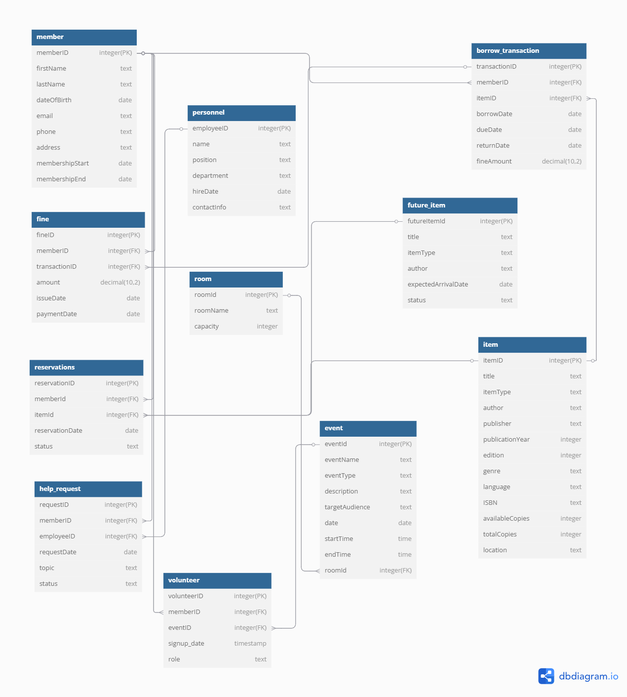

# Step 2: Project Specifications (10 Points)



	member = {memberId (PK), firstName,lastName, dateOfBirth, email, phone, address, membershipStart, membershipEnd}

	item = { itemId (PK) , title, itemType, author, publisher, publicationYear, edition, genre, language, ISBN, availableCopies, totalCopies, location }

	personnel = {employeeId, name, position, department, hireDate, contactInfo}
	
	borrow_transaction = { transactionId (PK), memberId (FK), itemId (FK), borrowDate, dueDate, returnDate, fineAmount }
	
	fine = { fineId (PK), memberId (FK), transactionId (FK), amount, issueDate, paymentDate }

	event = { eventId (PK), eventName, eventType, description, targetAudience, date, startTime, endTime, roomId (FK) }

	room = {roomId (PK), roomName, capacity}

	future_item = {futureItemId (PK), title, itemType, author, expectedArrivalDate, status}

	reservations = { reservationID (PK), memberId (FK), itemId (FK), reservationDate, status}

 	volunteer = {volunteerId (PK), memberId (FK), eventId (FK), signupDate, role}

	help_request = {requestId (PK), memberId (FK), employeeId (FK), requestDate, topic, status}
  	

## Relationships:

**member -> borrow_transaction**

A member can have multiple borrow transactions, but each only to one member meaning that this is a one-to-many

**item -> borrow_transaction**

An item can be borrowed multiple times, but each transaction is only for one item. Meaning this is a one-to-many

**borrow_transaction -> fine**

A transaction may result in a fine but a fine is only for one transaction. Meaning this is a one to many

**member -> fine**

A member can place multiple reservations, but each reservation is only for one of the members. Meaning this is a one to many.

**member -> reservations**

A member can place multiple reservations,but each reservation is only for one member.. Meaning this is a one to many

**item -> reservations**

An item can be reserved multiple times, but each reservation is only for one item. Meaning this is a one to many

**room -> event**

A room can host multiple events, but each event is in one room.

**personnel -> event**

Personnel organize events, but this isn’t explicitly modeled. Meaning this is indirect.

**member → volunteer** 
A member can volunteer for multiple positions, but each volunteer position is only for one member. Meaning this is a one to many

**personnel → help_request**
A personnel can handle multiple help requests, but each help request is assigned to one personnel. Meaning this is a one to many


# Step 3: E/R Diagram (10 Points)


# Step 4: Does your design allow anomalies? (15 Points)

## Member Table:
<!-- -Attributes: {memberId (PK), firstName,lastName, dateOfBirth, email, phone, address, membershipStart, membershipEnd} -->
FD: memberID -> firstName, lastName, dateOfBirth, email, phone, address, membershipStart, memebershipEnd
<br/>
BCNF: No violation since superkey exists.

## Item Table:
FD: itemId -> title, itemType, author, publisher, publicationYear, edition, genre, language, ISBN, availableCopies, totalCopies, location.
<br/>
BCNF: No violation since superkey exists.

## Personnel Table:
FD: employeeId -> name, position, department, hireDate, contactInfo.
<br/>
BCNF: No violation since employeeID superkey exists.

## borrow_transaction Table:
FD: transactionId (PK)-> borrowDate, dueDate, returnDate, fineAmount.
<br/>
BCNF: No violation since transactionId  superkey exists.

## Fine Table
FD: fineId (PK) -> amount, issueDate, paymentDate.
<br/>
BCNF: No violation since fineId superkey exists.

## Event Table
FD: eventId (PK) -> eventName, eventType, description, targetAudience, date, startTime, endTime, roomId (FK).
<br/>
BCNF:  No violation since eventID determines all other attributes.

## Room Table
FD: roomId (PK) -> roomName, capacity.
<br/>
BCNF: No violation as roomID determines roomName and capacity.

## future_item Table
FD: futureItemID (PK) -> title, itemType, author, expectedArrivalDate, status.
<br/>
BCNF: No violation as futureItemID determines all other attributes.

## Reservations Table
FD: reservationID (PK) -> reservationDate, status.
<br/>
BCNF: No violation exists.

## Volunteer Table
FD: volunteerID (PK) -> memberID, eventID, signup_date, role.
<br/>
BCNF: No violation exists as volunteerID is a superkey.

## Help Request Table
FD: requestID (PK) -> memberID, employeeID, requestDate, topic, status.
<br/>
BCNF: No violation exists as requestID is a superkey.


# Step (5): SQL Schema (15 points)

``` sql
--Create Tables
CREATE TABLE IF NOT EXISTS member(
  memberID INTEGER PRIMARY KEY,
  firstName TEXT NOT NULL,
  lastName TEXT NOT NULL,
  dateOfBirth DATE NOT NULL,
  email TEXT NOT NULL,
  phone TEXT NOT NULL,
  address TEXT NOT NULL,
  membershipStart DATE NOT NULL,
  membershipEnd DATE NOT NULL
);

CREATE TABLE IF NOT EXISTS item(
    itemID INTEGER PRIMARY KEY,
    title TEXT NOT NULL,
    itemType TEXT NOT NULL,
    author TEXT NOT NULL,
    publisher TEXT,
    publicationYear INTEGER,
    edition INTEGER,
    genre TEXT NOT NULL,
    language TEXT NOT NULL,
    ISBN TEXT NOT NULL,
    availableCopies INTEGER NOT NULL,
    totalCopies INTEGER NOT NULL,
    location TEXT NOT NULL
);

CREATE TABLE IF NOT EXISTS personnel(
    employeeID INTEGER PRIMARY KEY,
    name TEXT NOT NULL,
    position TEXT NOT NULL,
    department TEXT NOT NULL,
    hireDate DATE NOT NULL,
    contactInfo TEXT NOT NULL
);

CREATE TABLE IF NOT EXISTS borrow_transaction(
    transactionID INTEGER PRIMARY KEY,
    memberID INTEGER NOT NULL,
    itemID INTEGER NOT NULL,
    borrowDate DATE NOT NULL,
    dueDate DATE NOT NULL,
    returnDate DATE,
    fineAmount DECIMAL(10,2),
    FOREIGN KEY (memberID) REFERENCES member (memberID),
    FOREIGN KEY (itemID) REFERENCES item (itemID)
);

CREATE TABLE IF NOT EXISTS fine(
    fineID INTEGER PRIMARY KEY,
    memberID INTEGER NOT NULL,
    transactionID INTEGER NOT NULL,
    amount DECIMAL(10,2) NOT NULL,
    issueDate DATE NOT NULL,
    paymentDate DATE,
    FOREIGN KEY (memberID) REFERENCES member (memberID),
     FOREIGN KEY (transactionID) REFERENCES borrow_transaction (transactionID)  
);


CREATE TABLE IF NOT EXISTS room (
    roomId INTEGER PRIMARY KEY,
    roomName TEXT NOT NULL,
    capacity INTEGER NOT NULL
);

CREATE TABLE IF NOT EXISTS event (
    eventId INTEGER PRIMARY KEY,
    eventName TEXT NOT NULL,
    eventType TEXT,
    description TEXT,
    targetAudience TEXT,
    date DATE NOT NULL,
    startTime TIME NOT NULL,
    endTime TIME NOT NULL,
    roomId INTEGER,
    FOREIGN KEY (roomId) REFERENCES room(roomId)
);

CREATE TABLE IF NOT EXISTS future_item (
    futureItemId INTEGER PRIMARY KEY,
    title TEXT NOT NULL,
    itemType TEXT,
    author TEXT,
    expectedArrivalDate DATE,
    status TEXT
);

CREATE TABLE IF NOT EXISTS reservations (
    reservationID INTEGER PRIMARY KEY,
    memberId INTEGER,
    itemId INTEGER,
    reservationDate DATE NOT NULL,
    status TEXT,
    FOREIGN KEY (itemId) REFERENCES future_item(futureItemId),
    FOREIGN KEY (memberId) REFERENCES member(memberId)
);

CREATE TABLE volunteer (
    volunteerID INTEGER PRIMARY KEY,
    memberID INTEGER NOT NULL,
    eventID INTEGER NOT NULL,
    signup_date TIMESTAMP NOT NULL DEFAULT CURRENT_TIMESTAMP,
    role TEXT NOT NULL,
    FOREIGN KEY (memberID) REFERENCES member(memberID),
    FOREIGN KEY (eventID) REFERENCES event(eventID)
);

CREATE TABLE IF NOT EXISTS help_request (
    requestID INTEGER PRIMARY KEY,
    memberID INTEGER NOT NULL,
    employeeID INTEGER NOT NULL,
    requestDate DATE NOT NULL,
    topic TEXT NOT NULL,  -- The topic of help (e.g., Research, Book Recommendation)
    status TEXT CHECK (status IN ('Pending', 'In Progress', 'Resolved')) DEFAULT 'Pending',
    FOREIGN KEY (memberID) REFERENCES member(memberID),
    FOREIGN KEY (employeeID) REFERENCES personnel(employeeID)
);
```
# Step (6): Populate Tables (10 points)
```sql
--Step 6: Populate Tables-------------------------
INSERT INTO member (memberID, firstName, lastName, dateOfBirth, email, phone, address, membershipStart, membershipEnd) VALUES
(1, 'John', 'Smith', '1990-05-15', 'john.smith@email.com', '555-0101', '123 Maple St, Springfield', '2023-01-01', '2025-12-31'),
(2, 'Emily', 'Johnson', '1985-11-22', 'emily.j@email.com', '555-0102', '456 Oak Ave, Springfield', '2022-06-15', '2025-06-14'),
(3, 'Michael', 'Brown', '2000-03-10', 'michael.brown@email.com', '555-0103', '789 Pine Rd, Springfield', '2024-02-01', '2026-01-31'),
(4, 'Sarah', 'Davis', '1995-07-30', 'sarah.davis@email.com', '555-0104', '101 Elm St, Springfield', '2023-09-01', '2025-08-31'),
(5, 'David', 'Wilson', '1988-12-05', 'david.wilson@email.com', '555-0105', '202 Birch Ln, Springfield', '2022-11-10', '2025-11-09'),
(6, 'Laura', 'Martinez', '1992-04-18', 'laura.m@email.com', '555-0106', '303 Cedar Dr, Springfield', '2023-03-15', '2025-03-14'),
(7, 'James', 'Taylor', '1975-09-25', 'james.taylor@email.com', '555-0107', '404 Walnut St, Springfield', '2021-12-01', '2025-11-30'),
(8, 'Rachel', 'Lee', '2002-01-12', 'rachel.lee@email.com', '555-0108', '505 Spruce Ave, Springfield', '2024-01-10', '2026-01-09'),
(9, 'Thomas', 'Clark', '1998-06-08', 'thomas.clark@email.com', '555-0109', '606 Ash St, Springfield', '2023-07-01', '2025-06-30'),
(10, 'Kelly', 'Adams', '1980-10-20', 'kelly.adams@email.com', '555-0110', '707 Willow Rd, Springfield', '2022-08-15', '2025-08-14');

INSERT INTO item (itemID, title, itemType, author, publisher, publicationYear, edition, genre, language, ISBN, availableCopies, totalCopies, location) VALUES
(1, 'The Great Gatsby', 'Book', 'F. Scott Fitzgerald', 'Scribner', 1925, 1, 'Fiction', 'English', '978-0743273565', 3, 5, 'Shelf A1'),
(2, 'To Kill a Mockingbird', 'Book', 'Harper Lee', 'J.B. Lippincott', 1960, 1, 'Fiction', 'English', '978-0446310789', 2, 4, 'Shelf B2'),
(3, '1984', 'Book', 'George Orwell', 'Secker & Warburg', 1949, 1, 'Dystopian', 'English', '978-0451524935', 1, 3, 'Shelf C3'),
(4, 'Pride and Prejudice', 'Book', 'Jane Austen', 'T. Egerton', 1813, 2, 'Romance', 'English', '978-0141439518', 4, 6, 'Shelf D4'),
(5, 'The Hobbit', 'Book', 'J.R.R. Tolkien', 'Allen & Unwin', 1937, 1, 'Fantasy', 'English', '978-0547928227', 2, 5, 'Shelf E5'),
(6, 'Sapiens', 'Book', 'Yuval Noah Harari', 'Harper', 2014, 1, 'Non-Fiction', 'English', '978-0062316097', 3, 4, 'Shelf F6'),
(7, 'The Catcher in the Rye', 'Book', 'J.D. Salinger', 'Little, Brown', 1951, 1, 'Fiction', 'English', '978-0316769488', 1, 3, 'Shelf G7'),
(8, 'Dune', 'Book', 'Frank Herbert', 'Chilton Books', 1965, 1, 'Sci-Fi', 'English', '978-0441172719', 2, 4, 'Shelf H8'),
(9, 'The Alchemist', 'Book', 'Paulo Coelho', 'HarperOne', 1988, 1, 'Fiction', 'English', '978-0062315007', 3, 5, 'Shelf I9'),
(10, 'Educated', 'Book', 'Tara Westover', 'Random House', 2018, 1, 'Memoir', 'English', '978-0399590504', 2, 3, 'Shelf J10');

INSERT INTO personnel (employeeID, name, position, department, hireDate, contactInfo) VALUES
(1, 'Alice Carter', 'Librarian', 'Circulation', '2020-03-15', 'alice.carter@library.org, 555-0201'),
(2, 'Bob Thompson', 'Assistant Librarian', 'Circulation', '2021-07-01', 'bob.t@library.org, 555-0202'),
(3, 'Carol Evans', 'Cataloger', 'Technical Services', '2019-11-10', 'carol.evans@library.org, 555-0203'),
(4, 'Daniel Kim', 'IT Specialist', 'IT', '2022-02-20', 'daniel.kim@library.org, 555-0204'),
(5, 'Emma White', 'Event Coordinator', 'Programs', '2023-01-05', 'emma.white@library.org, 555-0205'),
(6, 'Frank Harris', 'Manager', 'Administration', '2018-09-01', 'frank.h@library.org, 555-0206'),
(7, 'Grace Patel', 'Reference Librarian', 'Reference', '2021-04-12', 'grace.patel@library.org, 555-0207'),
(8, 'Henry Moore', 'Custodian', 'Facilities', '2020-06-25', 'henry.moore@library.org, 555-0208'),
(9, 'Isabella Ruiz', 'Youth Librarian', 'Youth Services', '2022-08-10', 'isabella.r@library.org, 555-0209'),
(10, 'Jack Foster', 'Archivist', 'Special Collections', '2019-03-30', 'jack.foster@library.org, 555-0210');

INSERT INTO borrow_transaction (transactionID, memberID, itemID, borrowDate, dueDate, returnDate, fineAmount) VALUES
(1, 1, 1, '2025-02-01', '2025-03-01', '2025-02-28', 0.00),
(2, 2, 3, '2025-01-15', '2025-02-15', '2025-02-20', 2.50),
(3, 3, 5, '2025-03-01', '2025-04-01', NULL, NULL),
(4, 4, 2, '2025-02-10', '2025-03-10', '2025-03-05', 0.00),
(5, 5, 7, '2025-01-20', '2025-02-20', '2025-03-01', 5.00),
(6, 6, 4, '2025-03-15', '2025-04-15', NULL, NULL),
(7, 7, 8, '2025-02-25', '2025-03-25', '2025-03-20', 0.00),
(8, 8, 9, '2025-03-10', '2025-04-10', NULL, NULL),
(9, 9, 6, '2025-01-05', '2025-02-05', '2025-02-10', 1.25),
(10, 10, 10, '2025-03-20', '2025-04-20', NULL, NULL);

INSERT INTO fine (fineID, memberID, transactionID, amount, issueDate, paymentDate) VALUES
(1, 2, 2, 2.50, '2025-02-16', '2025-02-25'),
(2, 5, 5, 5.00, '2025-02-21', NULL),
(3, 9, 9, 1.25, '2025-02-06', '2025-02-15'),
(4, 2, 2, 1.00, '2025-02-20', '2025-02-25'),
(5, 5, 5, 2.50, '2025-03-01', NULL),
(6, 1, 1, 0.50, '2025-03-01', '2025-03-05'),
(7, 3, 3, 3.00, '2025-04-02', NULL),
(8, 6, 6, 1.75, '2025-04-16', NULL),
(9, 7, 7, 0.25, '2025-03-26', '2025-03-28'),
(10, 10, 10, 2.00, '2025-04-21', NULL);

INSERT INTO room (roomId, roomName, capacity) VALUES
(1, 'Reading Room A', 20),
(2, 'Conference Room B', 15),
(3, 'Study Room C', 10),
(4, 'Multimedia Room D', 25),
(5, 'Event Hall E', 50),
(6, 'Quiet Room F', 8),
(7, 'Children’s Room G', 30),
(8, 'Meeting Room H', 12),
(9, 'Tech Lab I', 18),
(10, 'Seminar Room J', 22);

INSERT INTO event (eventId, eventName, eventType, description, targetAudience, date, startTime, endTime, roomId) VALUES
(1, 'Book Club', 'Discussion', 'Monthly book discussion', 'Adults', '2025-04-05', '14:00', '15:30', 1),
(2, 'Story Time', 'Reading', 'Children’s story session', 'Kids', '2025-04-10', '10:00', '11:00', 7),
(3, 'Author Talk', 'Lecture', 'Meet the author event', 'All Ages', '2025-04-15', '18:00', '19:30', 5),
(4, 'Tech Workshop', 'Training', 'Learn coding basics', 'Teens', '2025-04-20', '15:00', '17:00', 9),
(5, 'Poetry Reading', 'Performance', 'Local poets perform', 'Adults', '2025-04-25', '19:00', '20:30', 2),
(6, 'Movie Night', 'Screening', 'Family movie event', 'All Ages', '2025-05-01', '17:00', '19:00', 4),
(7, 'Writing Seminar', 'Workshop', 'Creative writing tips', 'Adults', '2025-05-05', '13:00', '15:00', 10),
(8, 'Craft Hour', 'Activity', 'DIY crafts for kids', 'Kids', '2025-05-10', '11:00', '12:00', 7),
(9, 'History Lecture', 'Lecture', 'Local history talk', 'Adults', '2025-05-15', '16:00', '17:30', 3),
(10, 'Game Night', 'Social', 'Board games and fun', 'Teens', '2025-05-20', '18:00', '20:00', 8);

INSERT INTO future_item (futureItemId, title, itemType, author, expectedArrivalDate, status) VALUES
(1, 'The Midnight Library', 'Book', 'Matt Haig', '2025-06-01', 'Ordered'),
(2, 'Project Hail Mary', 'Book', 'Andy Weir', '2025-05-15', 'Ordered'),
(3, 'Klara and the Sun', 'Book', 'Kazuo Ishiguro', '2025-04-30', 'Shipped'),
(4, 'The Four Winds', 'Book', 'Kristin Hannah', '2025-05-20', 'Ordered'),
(5, 'Atomic Habits', 'Book', 'James Clear', '2025-06-10', 'Ordered'),
(6, 'The Vanishing Half', 'Book', 'Brit Bennett', '2025-05-25', 'Shipped'),
(7, 'A Promised Land', 'Book', 'Barack Obama', '2025-04-25', 'Delivered'),
(8, 'Where the Crawdads Sing', 'Book', 'Delia Owens', '2025-06-05', 'Ordered'),
(9, 'The Silent Patient', 'Book', 'Alex Michaelides', '2025-05-30', 'Shipped'),
(10, 'Circe', 'Book', 'Madeline Miller', '2025-06-15', 'Ordered');

INSERT INTO reservations (reservationID, memberId, itemId, reservationDate, status) VALUES
(1, 1, 1, '2025-03-01', 'Pending'),
(2, 2, 2, '2025-03-05', 'Pending'),
(3, 3, 3, '2025-03-10', 'Confirmed'),
(4, 4, 4, '2025-03-15', 'Pending'),
(5, 5, 5, '2025-03-20', 'Pending'),
(6, 6, 6, '2025-03-25', 'Confirmed'),
(7, 7, 7, '2025-03-28', 'Completed'),
(8, 8, 8, '2025-03-29', 'Pending'),
(9, 9, 9, '2025-03-15', 'Confirmed'),
(10, 10, 10, '2025-03-20', 'Pending');

INSERT INTO volunteer (volunteerID, memberID, eventID, signUpDate, role) VALUES
(1, 1, 3, '2025-03-25', 'Event Setup'),
(2, 2, 5, '2025-04-10', 'Usher'),
(3, 3, 10, '2025-04-15', 'Game Night Host'),
(4, 4, 2, '2025-03-20', 'Storyteller'),
(5, 5, 7, '2025-04-05', 'Writing Mentor'),
(6, 6, 4, '2025-03-30', 'Tech Assistant'),
(7, 7, 6, '2025-04-20', 'Movie Setup'),
(8, 8, 8, '2025-04-25', 'Craft Instructor'),
(9, 9, 1, '2025-03-15', 'Discussion Leader'),
(10, 10, 9, '2025-04-01', 'History Presenter');

INSERT INTO help_request (requestID, memberID, employeeID, requestDate, topic, status) VALUES
(1, 1, 2, '2025-03-01', 'Research Assistance', 'Resolved'),
(2, 2, 3, '2025-03-05', 'Finding a Book', 'In Progress'),
(3, 3, 5, '2025-03-10', 'Citation Help', 'Pending'),
(4, 4, 1, '2025-03-15', 'Library Card Issues', 'Resolved'),
(5, 5, 4, '2025-03-18', 'E-Book Access', 'In Progress'),
(6, 6, 6, '2025-03-22', 'Historical Archives', 'Pending'),
(7, 7, 7, '2025-03-25', 'Interlibrary Loan', 'Resolved'),
(8, 8, 8, '2025-03-27', 'Tech Help', 'In Progress'),
(9, 9, 9, '2025-03-30', 'Audiobook Recommendations', 'Pending'),
(10, 10, 10, '2025-04-01', 'Library Tour', 'Resolved');
```
